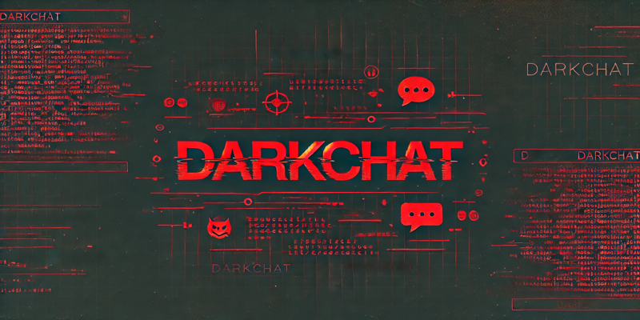

# DarkChat

A safe chatting to aim at chatting anonymously which written by C\#.  
 
It uses AES+RSA and random key to encrypt message end to end.  
 
1. You can set your own custom profile in the chat. 
2. Use AES256-GCM+RSA2048 and digital signature to encrypt the message end to end. 
3. It supports private chatting. 
4. It has GUI both server and client side. Easy to use. 
5. No any log about your login, it doesn't log anything. All operations execute in memory
